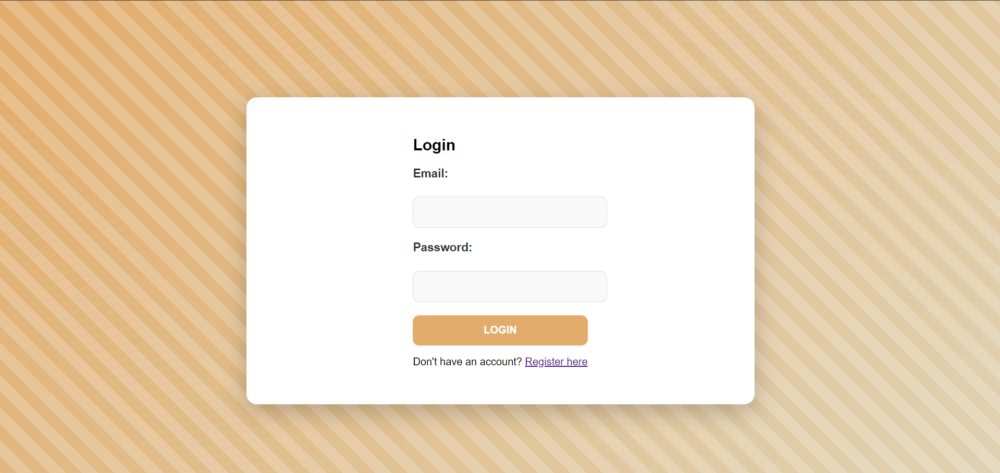
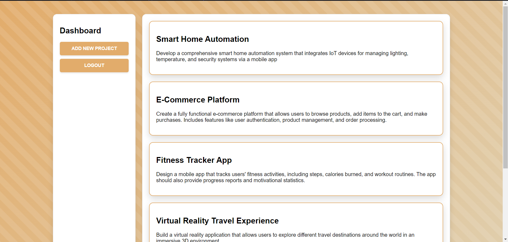
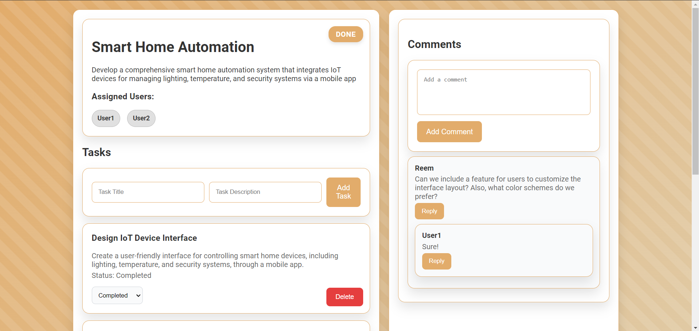

# Orbit

**Orbit** is a web application developed during my internship at CodeAlpha. This application provides a comprehensive platform for users to manage their projects, tasks, and user assignments. It allows users to create and track projects, assign tasks to different users, and manage project details efficiently.

## Table of Contents

- [Project Description](#project-description)
- [Features](#features)
- [Screenshots](#screenshots)
- [Future Additions](#future-additions)

## Project Description

**Orbit** is designed to help users organize and manage their projects effectively. The application includes features for project creation, user assignment, task management, and status tracking. It uses a MongoDB database to store project data and a Node.js server with Express to handle API requests.

## Features

- **User Authentication**: Secure login and registration for users.
- **Project Management**: Create, view, and manage projects.
- **Task Management**: Assign and track tasks within projects.
- **User Assignment**: Assign multiple users to projects.
- **Status Tracking**: Update and view the status of projects (e.g., Not Started, In Progress, Completed).
- **Comments**: Add and view comments associated with projects.

## Screenshots

*Include screenshots of your application here to showcase its features and interface.*

## Technologies Used

- **Frontend:** HTML, CSS, JavaScript
- **Backend:** Node.js, Express.js
- **Database:** MongoDB

## Future Additions

Here are some planned enhancements and features for future versions of Orbit:

- **Enhanced User Roles**: Implement different user roles with varying levels of access and permissions.
- **Project Analytics**: Add analytics and reporting features to track project progress and performance.
- **Notifications**: Introduce notifications and alerts for project updates and task deadlines.
- **Advanced Search**: Implement advanced search and filtering options for projects and tasks.
- **Mobile Optimization**: Improve the application’s design and functionality for better mobile device support.
